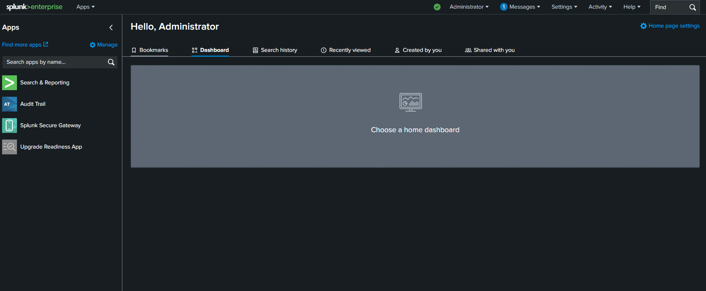

Splunk Cloud SIEM Lab

This repository contains Terraform code to deploy a Splunk-based SIEM lab in AWS, ingesting CloudTrail and VPC Flow Logs into an S3 bucket for Splunk to consume, and deploying Splunk Enterprise on EC2.

Overview

IaC: Terraform v1.7+ builds S3 bucket, CloudTrail, VPC Flow Logs, IAM roles, EC2 instance for Splunk.

AWS Logging: CloudTrail records management/API events. VPC Flow Logs capture network traffic.

Splunk: Deployed via user-data script; HEC enabled for custom events.

Prerequisites

Git

Terraform v1.7+ (tested on v1.11.x)

AWS CLI v2

AWS IAM profiles:

admin (full privileges)

terraform-admin (least-privilege for Terraform)

AWS CLI Profiles

aws configure --profile admin
aws configure --profile terraform-admin

Workflow

Initialize Terraform

terraform init

Import existing VPC Flow Log (only once)

terraform import aws_flow_log.default_vpc fl-0d7028fe77084fa11

Plan & Apply

terraform plan -out splunk.plan
terraform apply splunk.plan

Access Splunk Web

URL: http://<splunk_public_ip>:8000

Default admin login: admin / changeme (then reset)

Bootstrap admin password

sudo /opt/splunk/bin/splunk start --accept-license --answer-yes --no-prompt --seed-passwd 'YourNewPassword'

Install Splunk Add-on for AWS in Splunk Web (Apps → Find More Apps)

Configure AWS Data Inputs (Settings → Data Inputs → AWS)

HEC test

curl -k http://<splunk_ip>:8088/services/collector \
  -H "Authorization: Splunk <splunk_hec_token>" \
  -d '{"event":"HEC connectivity test"}'

## Architecture Diagram

  
*Figure 1: AWS resources and Splunk EC2 flow.*

## Screenshots

| Description                         | Image                                                                 |
|-------------------------------------|-----------------------------------------------------------------------|
| Terraform initialization             |                     |
| Terraform plan                       |                     |
| Terraform apply                      |                   |
| VPC Flow Logs import plan            |              |
| CloudTrail plan                      |                   |
| S3 bucket recreate policy update     |               |
| Splunk Web accessible (login screen) |                  |

Terraform plan/apply outputs

VPC Flow Logs in AWS Console

Splunk Web login and HEC test

Next Steps

Build searches and alerts (e.g., ConsoleLogin failures)

Create dashboards for network traffic

Develop Sigma rules in Splunk
